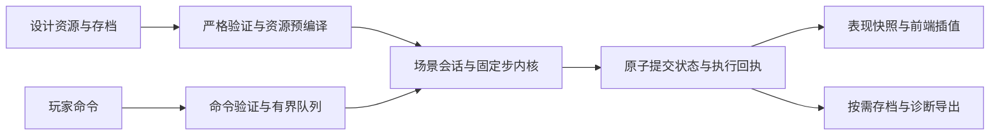

# T3a 实时模拟架构提案（2026-09-08）

状态：`PARTIALLY_IMPLEMENTED / E1c3_SCOPED_GATE_PASS / E2_3_IMPLEMENTED / E3B_IMPLEMENTED / E3C_STDIO_30MIN_PASS / P3_SCOPED_PASS / X1A_E5_NEXT / FULL_TACTICAL_NOT_PASSED`。承接 `t3a-performance-diagnosis.md`；E1—E3 已实现范围见各片报告，[E3c](./t3a-realtime-e3c-longrun.md)记录两舰后台工程测量，未实现的交战/保存/产品接线仍是提案。

2026-09-10 统一接续：以[编辑器与战术后续交付顺序](./editor-tactical-delivery-roadmap.md)为当前调度入口。P1a/P1b 状态与库存事务、P2a/P2b 普通炮及真实命中、P3 结算保存及跨场衔接已范围内完成，见[实现报告](./p3-settlement-redeployment.md)；下一项 X1a/E5 玩家设计出航及产品迁移。编辑器基本可用，O4 规范留档收尾；E3c 已通过两舰后台 30 分钟验证，技术舰的战后持久保存与下一场衔接已接通。统一弹药、特殊货物配方、共享容积货舱及超容保留规则见[状态规划](./tactical-persistent-ship-state-plan.md)。货物损毁与固定 2 小时门槛不进入本轮。战略模式仍是尚未实现的核心玩法；本轮为基础设施。P3 已接局部装甲/模块/船壳/库存的逐舰结算、原子保存与重启恢复；玩家自建设计进入此链路仍待 X1a/E5；合法结算默认完成已开始的装填，瞄准/目标不跨战斗保存。

2026-09-08 路线调整：保留现有舰体/舾装编辑框架，先以独立战术运行原型验证本提案，再决定迁移；未变领域共享规则，战术推进按用户确认的新政策简化；旧推进保留历史参考。当前执行顺序和继续/停止门以[实时循环实验规划](./t3a-realtime-experiment-plan.md)的 E0—E5 为准。[E0 基线准备](./t3a-realtime-e0-baseline.md)已完成，E1a 独立飞行会话与静态编译已落地，E1b 步内证明复用也已完成，随后实施 [E1c 固定贡献与简化推进](./t3a-realtime-simplified-propulsion-plan.md)，原来源指纹与诊断拆分后移为 E1d。[E1c.1 贡献编译](./t3a-realtime-e1c1-contributions.md)已实现，[E1c.2 独立飞行原型](./t3a-realtime-e1c2-flight.md)已运行新政策，E1c.3 范围内吞吐门已通过，下一步 P1 持久舰艇状态与出入战合同。设备/资源/指挥生产和内部重建已接入；实际战斗生产者、产品保存与桌面迁移仍未接齐。本文件 R1—R5 保留为技术拆分，不再要求先在旧热循环中全部完成。

## 1. 设计目标

将完整外部验证、运行时计算、通信表现和持久化分开。资源在进入场景时预编译并封闭所有权；单一权威执行器以 60 Hz 固定步运行，使用已验证的内部对象、阶段引用和局部动态检查；完整规范序列化在需要对外导出时执行。

保留现有积分、精确响应排程、非配平类安全和换向互锁、I9 权限与生命周期、事件顺序、战术不耗油等规则。新战术推进采用固定方向贡献，取消配平与血量直接缩放推力；相关预期差异单独版本化。试航样例的推力倍数仍只属于具名样例，不应用于玩家设计。

第一版继续使用当前 Python 权威后台、Rust 桌面桥和前端画布，不引入通用 ECS、分布式服务或整套第二物理内核。是否迁移具体数值热点由后续画像决定。

## 2. 五个职责边界

| 边界 | 负责 | 不进入每步的工作 |
| --- | --- | --- |
| 资源准备 | 严格解析、指纹、引用关系、几何与推进参数预编译 | 完整设计序列化、静态能力排程合法性重算 |
| 场景会话 | 唯一状态所有权、命令队列、步号、运行/暂停、提交 | 允许外部调用者任意替换内部状态 |
| 固定步内核 | 指挥、安全、机动、武器与战损的既有有序计算 | JSON 往返、自生成结果的完整重放验证 |
| 表现与回执 | 已提交状态投影、输入结果、可靠事件 | 由 UI 帧率驱动物理时间 |
| 存档与诊断 | 精确边界快照、规范 SHA、完整校验及可重放证据 | 默认每步构造所有嵌套调试对象 |

## 3. 数据与所有权

### 3.1 CompiledSceneResources：场景资源只读包

资源包包含船壳/舾装与精确来源、结构/几何缓存、稳定模块索引、发动机固定方向贡献及完好总量、编译后的转向等效力矩、原型及非配平安全配置、响应时间表和政策版本。E1a/E1b 仍使用现有 `ActualPropulsionContext`；E1c 的贡献表独立编译，不读取旧配平分配结果。未变静态模型和目标几何缓存复用只读资源，避免重复证明。

资源必须深层只读：复制外部容器，列表转元组，嵌套字典不能保留可写别名，冻结后的构造入口不再暴露写权限。仅给 dataclass 加 frozen 不足以支撑跨步复用。

第一版规定资源在场景生命期内不变。编辑后出航、读档和资源版本更换必须严格重建资源包，生成新的资源 epoch；不做运行中热替换。旧包的内部引用、缓存和待执行命令不可混入新会话。SHA 用来确认内容来源，epoch 用来区分当前内存实例，两者职责不同。

响应时间按原 Decimal/ceil 规则预编译，保留 2% 特殊阶段、中途改令起点与每步最多跨一阶的语义；运行时只查相应偏移和下一到期步，不重复扫描全部响应阶段。

### 3.2 WorldState：紧凑的已提交动态状态

保存位置、速度、姿态、引擎阶段/下一到期步、安全 governor、模块与人员状态、武器/弹丸、命令和生命周期等实际变化的数据。大型设计资源通过内部索引引用，不嵌入每个运行时视图和单步记录。

第一版采用类型化不可变记录及写时复制：每步构造候选，只复制发生变化的记录，共享只读资源和未变数据。测量证明有必要后，再将高频数值组织成紧凑数组；不先引入原地修改整世界后回滚的复杂性。

分域 generation 至少区分资源、推进可用性、结构/质量、运动、武器库存、人员与指挥状态。所有动态写入通过内核受控更新路径，同时更新依赖域。generation 是后台生成的事实，不接受客户端手填。

例如人员/供电/损伤改变会使有效推进能力失效；速度改变通常不需重编译额定推力，却仍改变阻力和安全载荷。每个缓存必须列出依赖，不能用“车钟未变”推导“安全状态未变”。

### 3.3 固定贡献与战损能力更新（用户确认的新政策）

详细合同、公式、切片与验收见[战术推进简化规划](./t3a-realtime-simplified-propulsion-plan.md)。本节替代此前按耐久曲线缩放并重算配平组的迁移要求；旧实现及 E1b 证据不改写。

进场时按每台发动机编译六方向贡献及完好总量，平移与转向分别汇总。转向力臂在编译时固化为方向等效力矩；战术运行不做配平，不产生主机偏置转向或转向机残余平移，不为受损设备降低健康设备输出。无需枚举整舰全部损毁组合。

血量归毁伤通道管理。首版部分掉血不直接衰减推力，完全损毁产生设备失效事件；供电、人员、宿主等其他可用性条件通过各自事件接入。多个原因共同决定最终可用性，修复一个原因不能覆盖仍存在的其他故障。旧半耐久 75% 曲线不进入新推进路径。

运行时维护方向剩余上限、比值与实际输出；损毁/恢复按固定贡献差量更新，重复事件不得重复扣加。档位和启动响应继续决定当前交付输出，稳定设备不反复解析；到期、改令和故障才更新相关贡献。非配平安全条件仍按需要使用当前运动状态判断。

步首已有故障本步生效；步内命中在既有收边界更新下一交付区间，不追溯取消已积分运动。保留速度/角速度，修复不瞬间满输出，发动机损毁不自动改变质量。贡献汇总、排程、领域事件与世界必须原子提交，读档从资源及可用状态重建汇总。

表现分别显示血量、剩余方向能力、响应输出与实际力/力矩。未接入的毁伤或设备依赖明确标为 NOT_COVERED，不能以无配平为由忽略；E2 检查依赖，E4 用真实命中验证。

### 3.4 BoundaryRef：内部阶段引用

内部来源绑定使用会话 epoch、资源 epoch、固定步、阶段以及状态 generation。必要时包含舰艇索引。阶段至少区分步首、命令/硬限制提交后、积分结果、战损后和收边界；同一步中的不同状态不能只靠 step_index 区分。

内部引用只能由会话/内核构造，进程外输入不接收 trusted 标志或内部证明。该机制用于管理程序内部所有权，不宣称提供针对任意恶意 Python 代码的密码学隔离。

对语义兼容的旧协议和存档，SHA 仍输出原规范值；简化政策不能伪装成旧 v7 配平记录，不兼容的导出/载入须明确版本化并拒绝错误政策。在兼容迁移期间，同一已提交不可变对象的 SHA 按需计算一次后复用；不能把 epoch/generation 数字直接冒充旧 SHA。中间态尚有旧 SHA 依赖时逐处迁移，不设全局关闭开关。

## 4. 单一权威循环与提交

一条线程拥有 WorldState、命令队列和所有动态缓存。I/O 与心跳不改世界；可读取已发布的不可变快照。固定步内不等待文件、网络、UI 或输出队列。

每步沿用当前统一场景的精确处理顺序：接受该开边界的输入，执行 I9 仲裁与到期逻辑，形成硬可用性/互锁/受控输出，运行现有机动与弹丸/战损流程，再按最终状态执行收边界安全与生命周期处理。未变领域提取现有阶段函数，推进阶段由 E1c 汇总内核替换，非配平安全另行接线；不把新结果包回旧完整推进合同，不重排当前弹药、损伤和推进因果关系。

步骤接口概念上为 `step_core(resources, committed_world, accepted_inputs) -> CandidateStep`。候选携带结果状态、有序领域事件、执行回执和必要的紧凑诊断事实；不默认生成完整 JSON 或保留可追溯到全部历史世界的对象链。

通过低成本动态不变量检查后，一起提交世界指针、步号、generation、输入状态和可靠事件。失败则保留上一个已提交世界，显式暂停。不得出现“步号已加一但回执未提交”的中间结果。缓存要么可丢弃重建，要么跟随候选提交，不能把失败候选的缓存用于旧世界。

现阶段 `advance_one` 要求表现投影失败也不提交该步。迁移第一阶段保持这一行为。未来若将表现投影异步化，应明确改变为“模拟已经提交、投影单独失败并从已提交状态重建”，依靠独立执行回执消歧；必须有版本化或清晰记录的行为变更及测试，不能静默改变后盲目重发输入。

## 5. 验证放在哪里

| 时点 | 验证内容 | 形式 |
| --- | --- | --- |
| 外部命令进入 | 字段、范围、场景身份、序号、目标窗口、基本权限 | 严格解析一次，转换为内部命令 |
| 资源创建/载入 | 内容 SHA、版本引用、几何、静态能力和排程合法性 | 完整验证及预编译 |
| 每步执行 | 命令是否仍有权限、当前阶段/时钟、可用性、软硬安全、互锁、库存等 | 类型化字段与局部不变量检查 |
| 状态变更 | 依赖域失效、新资源归属、局部数据合法性 | generation 与受控更新 |
| 存档导出/载入、外部证据验证 | 完整规范内容、SHA、引用与时序一致性 | 严格路径 |
| 回归/诊断 | 新政策增量/独立全量参考一致；未变领域对照；新旧规则差异、重放和篡改负例 | 离线或显式诊断运行 |

“信任内部对象”只省去重复解码、证明和重放；配平及血量直接缩放的取消是用户确认的独立规则变更，其他战斗规则不随之省略。例如发动机到期时是否仍能升阶、刚刚损毁是否断推、全舰载荷是否超限，都继续按每个合法物理边界判断。

## 6. 回执、审计与保存

执行回执是常驻的轻量事实：场景、输入序号、接受/执行/取消/拒绝状态、实际执行步与错误原因。相同指令不能因为确认丢失而再次生效。回执与可靠事件使用有界保留窗口；历史已淘汰时明确返回无法判定，不猜测结果或自动重发。

完整审计为显式诊断能力，记录输入、资源身份、事件和必要检查点，可离线重放以生成丰富证明。审计开关不改变模拟决策和事件顺序。逐步全量比对保留给回归工具，不作为正常实时运行的第二次模拟。

存档从一个已提交边界取得自洽快照，冻结该快照后可在独立 I/O 中序列化；不得混入下一步数据。保留原版本的规范输出与精确舍入，重载时重新构建资源和内部缓存。内部 token、缓存和对象地址不持久化。尚未支持的保存版本或来源变更继续明确拒绝或走具名迁移。

## 7. 调度、输入与表现

权威调度使用单调时钟及 1/60 秒固定步，有限步数/耗时的工作批次，并在步间处理控制请求。限定每轮请求处理量，避免大量 inspect 饿死仿真；同样不能让追赶模拟饿死暂停和退出。

出现过载时保留所有权威步，显式显示模拟落后；超过有界欠账阈值后暂停或进入定义明确的慢模拟模式，不丢步追赶。阈值应由当前两舰延迟测量确定，不在此承诺具体数值。

连续输入新增具名版本：后台发布有限未来步窗口，客户端指定目标步和单调输入序号；入队时和执行时分别检查格式/窗口与实时权限。旧 v1 当前开边界语义保留，不收到过期输入后擅自换步。接受后取消也留下终态回执，不能静默丢弃。

车钟为持续目标；转向为有明确有效期的临时输入。失焦/断连有清除或失效机制，返回编辑时先暂停并按已冻结合同处理待执行命令，避免恢复后执行积压转向。运行时允许更新控制，不再锁住整个操纵面板直到一段试航结束。

表现从已提交状态以约 10—20 Hz 生成快照，前端以显示帧率插值。最新完整表现快照可以覆盖旧快照；执行回执和可靠事件不可被合并丢失。可靠输出出现背压时在步间暂停并保留结果，避免队列无限增长或固定步内部阻塞。UI 读取和渲染速度不决定权威模拟时间。

## 8. 从现有代码迁移

| 切片 | 主要落点 | 退出条件 |
| --- | --- | --- |
| R1 静态预编译 | 推进时间内核、资源包、现有预验证绑定 | 响应能力不再每步重解析；静态缓存失效/所有权受测；结果一致 |
| R2 类型化阶段内核 | 完整安全适配器、时间边界、统一场景 | 同一内部对象不再反复 to_dict→parse→重放；动态安全检查保留 |
| R3 来源引用与诊断分离 | I9/v7 适配、结果合同、运行时视图、指纹调用链 | 大型静态 SHA 不在热循环重算；同一边界 SHA 复用；旧导出兼容 |
| R4 实时会话调度 | sidecar 工作线程、命令合同、Rust 桥和前端 | 连续控制、暂停、未来步输入、丢确认、背压和模式退出可靠 |
| R5 按新画像处理剩余热点 | 局部聚合/索引/数组或批量本地函数 | 达到实测目标且不改变事件及存档语义 |

R1—R3 是独立原型 E1/E2 使用的技术手段，R4 对应 E3，R5 由实测触发；E0 已完成，当前接续 E1。不能以“已有连续按钮”替代吞吐验收。保留原严格公共入口和当前记录结果作为对照；未变规则继续共享，E1c 推进按新政策实现，R2/R3 只处理新路径需要的部分，避免继续全面优化将被绕开的旧合同。

每片按具名政策比较逐步世界、指挥状态、事件和导出结果；旧规则黄金保留，新政策使用独立参考与预期差异清单，覆盖启动/到期/反转/制动、损毁/供电/人员/无燃料、资源或能力变更、失去直控、异常回滚、暂停、取消和读档重建。差异先解释或修正，不改黄金掩盖。

## 9. 可测的目标

当前诊断基线约 47 ms/步，已有两项实验合计约省 20%，不足以直接达到实时。本提案不预报未测得的提速倍数。

机制指标：正常热循环无 JSON 解码；完整静态设计 SHA 重算为零；静态响应时间解析为零；没有为验证自生成候选而重复执行其整段模拟；诊断输出关闭时不构造完整审计 JSON。保留必需的动态检查和过渡期兼容 SHA，并分别计数。

性能目标：两舰代表性负载的平均及尾部耗时需低于 16.67 ms/步并留余量，建议首先以 P95 约 12 ms 或更低作为工程余量目标，而非已获得的保证。测量记录 P95/P99/最大步耗时、实际模拟/墙钟比、命令延迟、内存及队列高水位。完成较长稳态、转向/制动与实际交火负载后再判定实时通过；6/20/30 舰和历史实例指纹问题保持独立验收范围。
