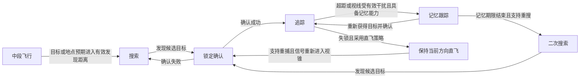

# 战术导弹导引头、失锁行为与电子对抗专题

日期：2026-09-16。状态：规则已汇总、进入分阶段实施准备，尚未接入现行实时战术。本文区分用户已明确的玩法目标、由既定规则导出的约束，以及待确认的实现方案；不作为工作包 5 完成记录。

实施顺序、跨文档衔接及剩余事项统一见[工作包 5a～5i](./tactical-stage5-implementation-plan.md)。下一片先做双方准备画布、编队与可调测试初始交战距离及补给，不等待全部导弹型号参数定稿。

## 一、导引头模块与型号差异

用户已明确：不同型号使用不同导引头模块，导引头能力、成本及占用空间共同影响型号定位。当前讨论不自动新增玩家自由组装导弹的编辑器功能。

| 类型 | 已明确的游戏定位 | 仍需细化 |
| --- | --- | --- |
| 主动雷达 | 适合远程、全天候攻击，容易受到对应电子干扰；基础锁定距离 10～30 公里量级，云层保留 80%、雨层保留 40%；超距或视线被有效箔条云遮挡即失锁 | 各型号具体距离/倍率、视场与锁定确认时间、主动诱饵识别 |
| 红外 | 被动感知、隐蔽性好、精度高；基础锁定距离 4～12 公里量级，云层保留 30%、雨层保留 50%；超距或视线被有效热能烟雾遮挡即失锁 | 热特征来源、各型号具体距离/倍率、主动诱饵识别 |
| 被动雷达／反辐射 | 追踪目标雷达辐射；失去信号后低级型号直飞并等待视锥内重新出现信号，高级型号飞向最后已知区域等待重捕；首版主动诱饵可诱骗 | 可识别辐射源、视锥及确认时间、各型号能力配置 |
| 复合 | 本轮明确雷达与红外复合，云层保留 80%、雨层保留 50%；单独箔条或热能烟雾不能有效干扰，两者同时遮挡导弹至目标的视线即失锁；成本/空间更高并降低战斗部威力 | 基础锁定距离、各型号具体倍率、主动诱饵作用、空间与战斗部的权衡数值 |

“射程近”在导引头设计中按探测和跟踪范围表达，导弹实际可飞距离仍由独立动力和寿命规则决定。全天候是相对环境适应能力，不先确认雷达完全不受云雨影响；被动感知的隐蔽性也不代表整枚导弹无法被发现。复合导引头各通道继续受自身工作条件约束，不能直接实现为无条件免疫干扰。以上用于避免把定位描述变成额外的绝对能力。

### 锁定距离与高度层首轮标定（2026-09-16 已确认）

| 导引头 | 基础锁定距离量级 | 上层 | 云层 | 雨层 |
| --- | --- | --- | --- | --- |
| 主动雷达 | 10～30 公里 | 100%：10～30 公里 | 80%：8～24 公里 | 40%：4～12 公里 |
| 红外 | 4～12 公里 | 100%：4～12 公里 | 30%：1.2～3.6 公里 | 50%：2～6 公里 |
| 雷达＋红外复合 | 按型号另定 | 100% | 80% | 50% |

这些数值是游戏设计与首轮标定依据，具体型号可拥有自己的基础距离和环境倍率。2026-09-16 更新：有效锁定距离＝该型号基础锁定距离×目标当前所在高度层的天气倍率；百分比是保留比例，雨层不再叠乘云层倍率。已锁目标离开导弹作用层后，不直接以换层为由失锁，而是按目标新层的天气重新判断范围，并继续检查视场、信号和有效干扰。仍满足条件时可维持锁定；不满足时按型号失锁行为处理。

该更新允许维持对换层目标的锁定，不改变导弹的唯一飞行/命中作用层：导弹不会随目标换层，不能命中异层目标。动力、跨层降速与无动力寿命仍使用发射时确定的导弹作用层，不随目标换层重算；发射舰或观察画布层也不决定锁定天气。失锁后的记忆仍不能读取未知目标的新位置或机动。

复合导引头本轮按整体性能配置上述锁定距离和范围干扰抗性；使用单一箔条或热能烟雾不能通过强制降为单模、套用更短锁定距离等方式绕过已确认抗性。当导弹至目标的同一条视线同时被有效箔条云和热能烟雾遮挡时，复合导引头失锁；两种装备仅在战场上同时存在不足以满足条件。该规则针对箔条和热能烟雾，不自动决定主动诱饵或数据链干扰的效果。

距离与状态衔接已确认：天气修正后的有效锁定距离同时用于获得锁定和维持实时跟踪，不另设更远的维持上限。目标离开该距离即失去实时跟踪；有效距离内没有敌舰时，攻击敌舰的导弹没有可锁定舰艇目标。导弹与目标之间出现对应的有效干扰区域也立即失锁，而不是再乘一层缩距倍率。失锁后按型号进入记忆跟踪或失的直飞，后续是否二次搜索仍由型号能力决定，不触发立即自毁。

### 视线遮挡与重新捕获

范围干扰的空间判据是导弹当前位置至目标位置的视线线段与对应有效干扰区域相交，不要求导弹本身飞入该区域。主动雷达对应箔条云，红外对应热能烟雾；复合要求这条视线同时经过两类有效区域，两类区域可以位于视线不同位置。失锁期间只使用合法历史情报或数据链信息，不继续读取真实目标机动；仅恢复距离/视线条件不直接免除该型号的搜索和锁定确认过程。

搜索范围内存在多个合法目标时，优先选择最近的大目标；按“大目标优先，同档距离近者优先”组织首版排序，大小判据和阈值按目标特征继续配置。失去锁定后优先重新捕获原目标，原目标必须重新满足距离、视锥、信号和干扰条件，不能仅凭目标编号保持或恢复跟踪。原目标不可重捕时，其他候选按上述搜索规则处理；已经正常跟踪时不因出现更近目标而无条件换靶。此规则用于弹载搜索，不覆盖近防系统既定的撞舰威胁排序或玩家明确下达的目标。

上述以攻击敌舰为例；拦截导弹仍只使用合法来袭弹体候选，不要求附近同时存在敌舰，也不能因“大目标”排序锁定本来不合法的对象。半主动雷达及反辐射的天气参数、视锥和具体确认时间按型号标定。

现实资料仅作为定性参考，固定距离和倍率以游戏设计为准。实际云雨作用与所用波段等条件有关，并非所有雷达与红外传感器都有同一套相反关系，参考 [NASA：云与降水的辐射及散射](https://www.giss.nasa.gov/pubs/abs/ba02200i.html)。

### 旧规划术语衔接

旧文把依赖母舰持续照射的制导方式称为“被动雷达制导”。本次统一称为“半主动雷达制导”，保留其原有发射和持续照射条件；“被动雷达／反辐射”用于追踪目标自身雷达辐射。术语依据：[美国海军 ESSM 说明](https://www.navy.mil/Resources/Fact-Files/Display-FactFiles/Article/2168978/evolved-seasparrow-missile-block-1-essm-rim-162d/)、[NAVAIR 被动反辐射与复合制导说明](https://www.navair.navy.mil/node/4566)。

旧光电导引头“搜索范围较小、只在上层工作”的规则暂时保留。新红外导引头与旧光电类别是否拆分，以及旧光电在首批型号中的位置，继续讨论；不自动把旧上层限定套用到新增红外类型。

旧原型仍使用 `passive_radar` 表示依赖照射的制导方式，后续接入需显式处理兼容映射，不能直接将该字段解释为反辐射。本轮只整理设计与名称，不修改原型契约或运行时代码。

## 二、制导状态机与信息边界

用户已明确：应存在清晰状态机，覆盖中段飞行、搜索、锁定、追踪、记忆跟踪、二次搜索及最终自毁。它是可回转、可按型号跳过阶段的过程，不要求每发导弹依次经过所有状态。

以下为状态转换草案，具体阈值和时间待型号设计明确：

所有飞行状态都持续消耗既定寿命，并可因实际命中、耐久耗尽或总寿命到期而结束；这些是全局终止条件，不是只能从二次搜索进入的最后一步。初次搜索失败、重搜失败和数据链更新后的具体状态入口按型号继续细化。

### 记忆跟踪

设计目标是让失锁产生真实的机动窗口。导弹只能根据最后有效观测和获得的合法更新预测，不能在失锁后继续读取目标真实位置、航向或速度。一般运动目标的预测可利用最后已知位置、速度与观测时间；反辐射型号仍遵守最后已知辐射位置规则，具体外推能力由型号决定。

防守舰失锁后的突然转向应让预测位置与实际位置逐渐分离；重新跟踪必须先通过导引头实际感知或有效数据链更新，不能靠保留原目标编号自动恢复精确追踪。数据链目标情报与导引头自身锁定是不同信息来源，详细转换条件仍待定。

### 丢失后行为与二次搜索

用户已明确不同型号拥有不同处理能力：老式或廉价型号可以失锁后保持当前方向直飞；先进型号可以记忆跟踪并进行 8 字形二次搜索；支持数据链的型号可接收新目标信息重新攻击。具体能力以型号配置为准，不仅由导引头类型或价格自动推定。

半主动照射中断或反辐射目标停机后的重捕按型号处理：低级型号先直飞，其被动/半主动雷达导引头视锥内重新出现有效信号后可以重捕；高级型号飞向目标最后已知区域，等待信号重新出现。原目标可用时优先重捕原目标，不能因继续记忆飞行而视为仍有实时锁定。低级雷达型号的直飞不再等同于永远关闭接收或必须直飞到自毁，其他导引头是否具备对应重捕能力仍按型号配置。

直飞失的弹沿用预定计时自毁规则，不另引入飞行中换层或动力耗尽立刻坠毁。8 字搜索必须实际飞行和转向，受最大过载、低速能力及每 1G·秒损失 9.8 米/秒的既定规则约束；主发动机仍工作时可补偿，无动力时持续耗速。

制导状态与助推/主发动机/无动力状态分别运行：导引头重捕、二次搜索或数据链更新不能重启发动机、补回速度、重置寿命或改变固定作用层；助推段即使已获得目标信息，也不能执行转向机动。目标换层后可按新层天气维持感知，弹体本身仍不跨层搜索或追击。

## 三、电子对抗装备

用户已明确：需要箔条、有源诱饵等可用装备，由玩家和 AI 舰艇使用，使导引头进入记忆跟踪或搜索切换，为实际机动提供窗口。防御结果应体现装备使用与机动的作用，不能仅依赖一次随机判定。

装备分工已确认：按装备型号区分，便宜的箔条与热能烟雾以区域遮挡导弹至目标的视线，使对应导引头失锁，不作为可误锁目标，也不要求导弹本身位于区域内；昂贵的主动诱饵生成可被导弹误锁、实际转向追踪的诱饵目标。主动诱饵被追踪时，导弹本身仍处于追踪状态；诱饵消失或失去有效信号后，再按导弹型号进入记忆、重搜或直飞行为。

2026-09-16 复合抗性与干扰作用已确认：主动雷达的视线被有效箔条云遮挡、红外的视线被有效热能烟雾遮挡时失锁；雷达与红外复合只有该视线同时被两类有效区域遮挡才失锁，单用其中一种不能有效干扰。首版主动诱饵同时模拟雷达和红外信号，能够诱骗全部导引头，包括复合、半主动和反辐射；这是可成为误锁目标的能力，不等于一经部署就强制所有导弹转向。后续可另加不能诱骗复合导引头的廉价型号，不将这一削弱先套用到当前型号。

### 首批干扰装备与使用

| 装备 | 首批型号 | 安装与操作 | 装填消耗及效果 |
| --- | --- | --- | --- |
| 箔条发射器 | 小型、大型各 1 种 | 侧挂/外挂，不占内部空间，无需人员；玩家手动发射 | 消耗工程材料重新装填，在部署原地形成箔条区域 |
| 热能烟雾发射器 | 小型、大型各 1 种 | 侧挂/外挂，不占内部空间，无需人员；玩家手动发射 | 消耗工程材料重新装填，在部署原地形成热能烟雾区域 |
| 主动诱饵发射器 | 当前先 1 种 | 类似 VLS，可指定方向发射；具体安装与工作参数另定 | 消耗工程材料和涡喷零件装填，生成同时模拟雷达/红外、可诱骗全部导引头的目标 |

箔条云和热能烟雾区域在世界坐标中留在部署原地，不随舰艇移动，持续几十秒至几分钟；范围和持续时间按大/小型号配置，具体数值另定。主动诱饵不是这类静止遮挡区域，其定向飞行、速度与有效信号寿命后续标定。

玩家在火控雷达或红外搜索发现敌方导弹后可以使用干扰装备。AI 发现导弹后必然使用船上已有且可用的干扰弹发射器，不设置是否使用的随机概率；仍遵守装填、库存和设备工作条件，不能按每次画面刷新重复发射。持续发现同一威胁时的再次部署间隔、各类区域的高度层/友方影响、主动诱饵与真目标的竞争判据、具体操作入口继续细化。

## 四、数据链

用户已明确：部分先进型号支持玩家通过数据链提供新目标信息，允许重新攻击。它扩展原规划中“导弹自主飞行”的指令能力，具体航迹仍由导弹自动执行；不因此新增逐帧直接操纵弹体。

已确认：支持数据链的导弹允许装有相应设备的任意友舰接力提供有效目标情报，包括重新指定目标；导弹仍只作用于发射时选定的高度层。舰队核心对舰船指令的抗干扰设定不自动扩展到导弹数据链。

舰间观测共享使用新增“数据链”附加设备，可安装在指挥机上。每舰一部有效数据链即可与其他具备有效数据链的友舰共享火控和跟踪数据；可增设备份，避免单部数据链损毁后立即丧失共享能力，不把备份数量自动当作额外共享权限。发送与接收必须来自有效观测和工作中的设备，不因接入数据链就获得未侦测目标的真实状态。

数据链与指挥机的挂载、备份安装和战损关系需要接入模块系统。用户已确认：即使本舰雷达和红外设备全部不可用，只要指挥机与数据链正常，友舰共享的有效跟踪数据也可替代本舰传感器来源，支持普通火控与拦截；不再要求接收舰必须同时有一部本地传感器。观测来源丢失或数据过期后不能继续当作实时精确跟踪。传输范围/时延、情报有效性、干扰与接力时序、给在途导弹的数据更新和自主重捕关系继续细化。改攻其他目标的能力已确认，不再作为行为待定项；数据链不能替代半主动武器要求的实际照射。任何更新都继续遵守固定作用层、剩余动力/寿命及相应导引头工作条件。

## 五、舰载导弹侦测与指挥机（2026-09-16）

### 组件分工与安装

| 组件 | 安装与空间 | 功能与已确认条件 |
| --- | --- | --- |
| 火控雷达 | 纯外部贴放，不占内部空间；需要周遭工作净空 | 在可工作范围内发现、跟踪导弹，受雷达对应天气与箔条云影响；保留相应雷达照射功能 |
| 红外搜索（IRST） | 纯外部贴放，不占内部空间；需要周遭工作净空 | 在可工作范围内发现、跟踪导弹，受红外对应天气与热能烟雾影响；可独立提供拦截目标情报，无需火控雷达开机 |
| 指挥机（原“火控系统”） | 内部火控数据计算机，只占内部空间，不占外部空间 | 使用本舰有效雷达/红外观测，或经数据链接收的友舰有效跟踪数据，提供相应火控解算 |
| 数据链 | 可安装在指挥机上的附加设备 | 每舰一部有效设备即可与同样具备数据链的友舰共享火控/跟踪数据，可增设备份 |

火控雷达与红外搜索沿用局部露天甲板上的纯外部模块安装框架，具体外部轮廓、工作净空形状/大小按型号配置；净空要求与内部占格相互独立，不能因此给传感器增加内部占用。净空也不计入可命中实体面积。指挥机既无本地有效观测、也无数据链共享的有效跟踪数据时，对应火控功能不可用；沿用既有模块依赖规则，不因此禁止安装、保存或建造。

观测数据可来自雷达或红外中的任一路；一条通道受阻时，另一条有效通道仍可提供情报。普通武器的红外独立感知不等于免除指挥机；下述进阶防御型号可用内置计算能力完成自身拦截。红外不替代半主动雷达导弹所需的实际雷达照射。指挥机只处理有效观测，不因存在计算设备就获得全场导弹真实位置。

### 雷达资源与跟踪分配

每部火控雷达提供独立的“雷达资源”额度，高级型号额度更充裕。用户已确认这是同时跟踪目标的占用预算：开始跟踪时占用，停止跟踪后释放，不是逐秒消耗的库存，也不额外加入资源补给或恢复计时。

跟踪成本与目标特征有关：低速大目标占用很少，高速大目标占用更多；小目标及不同速度/尺寸组合的具体成本按后续参数表确定。一部雷达剩余额度不足时不能接管新的目标，可由其他有足够额度且满足感知条件的雷达承担；保留每部雷达各自的跟踪分配，不能仅合计全舰额度就当作任一雷达都能跟踪。

数据链共享已有观测不要求接收舰重复使用本地雷达跟踪同一目标；实际承担观测的雷达仍占用对应资源。若本地雷达也独立跟踪，则按它自身的目标分配计入占用。跟踪目标加速导致成本变化、雷达受损导致额度下降时的重分配/舍弃顺序，具体成本函数及界面表达继续细化。红外设备的并发能力另行配置，不把雷达资源自动套用到红外搜索。

### 自带雷达或红外跟踪器的防御武器型号

2026-09-16 用户补充并确认：为近防炮和自动拦截发射器增加自带火控雷达或红外跟踪器、同时内置专用火控计算能力的进阶型号，以增加重量为代价。该能力按型号提供，不默认添加到所有近防武器，也不默认每款同时拥有雷达与红外两套通道。

有拦截任务时，配套传感器优先服务本武器的目标跟踪；没有拦截目标时，仍可作为性能稍弱的火控雷达或红外跟踪设备工作，将有效观测接入本舰火控体系，为其他武器提供目标情报。“无威胁待机”只表示武器不自动开火，不表示这类型号的传感器停止工作。通用跟踪性能应低于对应独立设备，具体距离、视场、通道数和更新频率按型号标定；红外型仍区分有动力与无动力导弹，不直接照搬独立红外搜索的 50/12 公里参数。

自带传感器沿用对应类型的本层/相邻层搜索、目标层天气倍率、视线干扰和有效观测要求。作为指挥机的有效雷达或红外来源时，可以满足其感知依赖；向其他武器提供情报仍遵守其指挥机、照射和通道条件。火控页面应能识别观测来自独立设备还是防御武器自带设备，不把共享观测当作额外的无限跟踪通道。

安装上属于带传感器的武器型号，沿用该武器的内外占用框架，并按实际外部结构配置净空；独立火控雷达/红外搜索的“纯外部、不占内部空间”规则不改变武器自身占格。具体外形、尺寸、资源与人员需求、传感器及武器的战损关联留待型号设计。

已确认：进阶型号依靠自身有效传感器与内置专用计算能力完成本武器的自动拦截，舰内指挥机失效时仍可工作。独立能力服务本武器，不自动替代全舰指挥机为其他普通武器解算；自身感知、供电、弹药、射界、作用层及弹种照射条件仍须满足。普通型号保持原有火控依赖。

进阶型号的模块重量须高于对应不带这套能力的基础型号，将内置传感器和火控计算设备的增重计入模块标称质量及舰艇干重。该增重进入设计、战前准备和现有质量计算，因而在相同升力下减少升力冗余、增加主动换层基础耗时；它是安装设备重量，不作为挂载或货物排除。具体增重按型号标定，不在本轮指定统一百分比或吨数。

执行拦截时是否仍可向其他武器持续提供观测、关闭自动拦截后的传感器开关关系等调度细节，随具体型号继续明确。

### 高度层、环境与干扰

已确认两类舰载传感器均能搜索本层和相邻层，不能直接搜索隔两层的导弹。相邻层搜索也受对应气象影响，按被搜索导弹所在层选择该感知类型的天气倍率；舰艇能看见相邻层目标不改变任何弹药的唯一作用层与合法发射范围。

按用户“与导引头类似”的要求衔接已定同类型倍率：火控雷达云层保留 80%、雨层 40%；红外搜索云层保留 30%、雨层 50%，上层均为基础值。倍率直接相对基础值选取，不逐层叠乘。舰载火控雷达的基础发现距离尚待型号设计，不能直接照搬导弹雷达导引头的 10～30 公里。

有效范围内仍需感知连线通畅：火控雷达至来袭导弹的连线被有效箔条云遮挡，或红外搜索至来袭导弹的连线被有效热能烟雾遮挡时，对应感知通道不能继续实时跟踪。不要求传感器或来袭导弹本身处于干扰区域内。传感器损毁、关闭、净空或其他工作条件不满足时，也不能提供该通道的有效情报。目标显示、历史航迹保留、观测共享和丢失后的自动拦截处理仍需继续细化。

### 红外发现距离随动力状态变化

用户已明确红外搜索对动力段导弹的基础发现距离约 50 公里，无动力滑行时约 12 公里。首轮按当前是否仍处于助推/主发动机推进阶段区分，进入无动力段即使用滑行距离；不额外引入尚未要求的余热衰减阶段。

| 来袭导弹状态 | 上层基础距离 | 云层（30%） | 雨层（50%） |
| --- | --- | --- | --- |
| 有动力飞行 | 约 50 公里 | 约 15 公里 | 约 25 公里 |
| 无动力滑行 | 约 12 公里 | 约 3.6 公里 | 约 6 公里 |

该变化影响防守传感器对来袭导弹的可发现/实时跟踪范围，不改变导弹自身导引头、当前速度或寿命。如果熄火后超出新红外范围，该通道失去实时跟踪；其他有效传感器仍可维持目标情报。50/12 公里的规则针对导弹，不自动作为普通炮弹的红外发现距离。

### 与现有实现衔接

核对现有测试目录：原火控系统已只有内部占格，原搜索雷达已是纯顶挂、无内部占格，但没有周遭净空配置。工作包 4 的近防当前要求雷达与火控计算同时可用，未包含本专题的红外独立感知、动力状态热特征、云雨或遮挡规则。现行技术雷达和火控的固定距离不是新组件的已定性能。

后续接入需明确新增独立火控雷达/红外搜索及自带传感器的防御武器型号，更名并保留指挥机的内部安装语义，将可用感知来源扩展为独立或武器自带的雷达/红外，再接入净空、按层天气、视线干扰及目标当前动力状态；保持武器自身解算、照射、通道、弹药和射界条件。编辑器显示、已保存设计/实例兼容和战损反馈须同步处理。本次只更新规划，未更改目录、契约字段或运行时代码。

## 六、发射方式、导引头开机与操作页面（2026-09-16）

### 两种发射方式

以下“对准后发射”适用于炮塔式发射器。2026-09-16 新增的 VLS 同样支持目标/地点指定，但可向任意水平方向发射，以延迟模拟已出膛导弹的调转方向，不要求炮塔式的转向对准与水平射界；具体见第七节。该延迟不消耗动力或寿命，导弹在平面战场出现后才开始正常三段飞行；延迟期间已经发射，不能改令或退弹。

| 方式 | 玩家操作与发射准备 | 助推段 |
| --- | --- | --- |
| 指定目标发射 | 类似炮塔操作，由舰载火控锁定指定目标，发射器对准有效目标情报给出的位置后开火 | 沿该次发射确定的目标方向加速，保持助推段不能转向的既定规则 |
| 指定地点发射 | 玩家指定导弹射程内的某个位置，控制发射器对准该位置并手动发射 | 沿该次发射确定的地点方向加速，同样不能转向 |

“锁定目标后发射”中的锁定由有效舰载火控完成，不要求弹载导引头提前开机；普通型号使用舰内指挥机，进阶防御型号可用其内置计算能力。指定地点无需先选中敌舰；地点是航向与搜索的参考，不自动新增到点起爆规则。发射允许射程与导引头发现距离不同，允许先向更远的合法地点发射，接近后再搜索。炮塔式的转向/瞄准/射界、VLS 的出弹延迟，以及通用的装填/库存、作用层及各型号特有的照射条件仍需满足；点选地点不绕过半主动型号的持续照射要求。

助推时长与固定方向沿用已确认动力规则。重新分配发射器目标影响其后续发射任务，已发射导弹仍按自己的任务运行；玩家主动更新在途导弹任务须使用其支持的数据链，不因切换面板或更改发射器目标而自动重定向。 拦截弹原目标被其他武器消灭后，可按下文规则自主搜索并追踪新目标；这与玩家改令分开处理，不要求仅为自主重捕另发一条数据链命令。

### 导引头何时开机

用户已确认：只有指定目标或地点预期进入该导引头的有效发现距离后，导引头才开机并开始搜索。针对已知目标，按合法情报中的目标所在层进行天气修正；指定地点无目标层情报时使用该发指定的作用层，实际搜索/跟踪再按候选目标当前层判断。开机意味着开始获取目标，不等于立即成功锁定，也不能为计算开机时间偷读未知目标换层。

目标预期位置应来自发射时获得的有效目标情报及本弹合法收到的数据链更新；没有新信息时依据已有信息预测，不能为判断开机时间持续读取尚未发现目标的真实位置。指定地点模式使用该地点作为距离参考。助推、主发动机和无动力计时继续独立运行，不因开机或搜索刷新。

近距发射边界已确认：如果发射时目标/地点已经位于有效发现距离内，导引头立即开机搜索；助推段仍保持固定方向，助推结束后才允许执行转向。开机/搜索状态可以与助推状态并行，不额外添加统一的助推后开机门槛。对 VLS，该判断从导弹出现在平面战场、开始正常飞行时执行；此前为已经出膛的转向阶段，不运行正常三段飞行与弹载搜索，不能改令。

### 火控与导弹页面

在现有舰况、火炮（用户所称炮塔）和损管面板之外新增“火控”“导弹”两个页面，继续使用同一战场和所选舰艇面板框架。

| 页面 | 展示与主要操作 |
| --- | --- |
| 火控 | 展示已发现的敌舰与敌方导弹；选择目标进行舰载火控锁定；针对该目标选择并分配反舰或拦截导弹执行发射 |
| 导弹 | 展示现有导弹、兼容发射器及当前状态；为每个发射器指定目标、执行单发射击或启用自动开火；也可指定射程内地点进行手动发射 |

火控页按目标组织，导弹页按发射器组织，两页读取和修改同一份目标分配、火控与发射状态，不能分别维持两套互不一致的命令。发现目标不等于该目标已满足锁定/发射条件，页面应显示对应可用状态和未满足条件。舰艇、弹体与地点仍明确区分，反舰/拦截型号只使用合法目标类型；无耐久小口径炮弹仍不能作为拦截导弹目标。

2026-09-16 默认开关按发射器用途区分：普通反舰发射器与普通拦截发射器的自动开火默认关闭，由玩家执行单发或显式开启；新增专用近程拦截发射器，自动防御默认开启，像近防炮一样自主选择来袭目标实施拦截。近防炮、损管已有默认设置不变。指定目标或执行一次单发不隐含改变自动开关，切换页面也不改变开关或触发发射；所有发射仍遵守合法目标、库存/装填、火控、射界与作用层条件。用户原文“单发设计”按上下文记录为“单发射击”。

### 专用近程自动拦截发射器

| 发射器用途 | 默认自动状态 | 操作定位 |
| --- | --- | --- |
| 普通反舰 | 关闭 | 玩家指定舰艇或地点，执行单发或主动开启自动开火 |
| 普通拦截 | 关闭 | 玩家分配拦截目标，执行单发或主动开启自动开火 |
| 专用近程拦截 | 开启 | 如近防炮一样自动选择来袭威胁并拦截，玩家可关闭/恢复自动防御 |

近程自动防御无需玩家逐枚分配目标，无可拦截威胁时待机。按近防已定的威胁筛选和优先级方向处理已发现、预计会撞击本舰或友舰的合法弹体，继续排除无耐久小口径炮弹。普通型号的有效目标情报来自可用雷达或红外搜索，经指挥机处理；自带传感器和专用计算能力的进阶型号可独立完成自身拦截。自动默认开启不绕过感知、相应计算能力或弹种的制导/照射条件。

2026-09-16 补充分工：专用自动拦截发射器的有效拦截射程须大于近防炮，自动锁定近防炮范围外的大型高速目标，形成较外侧的防御范围。“近程”名称不表示射程短于近防炮。仍须满足已发现、预计撞击本舰或友舰、具有弹体耐久及实际可拦截等条件，不向仅从附近经过的弹体自动耗弹。

每个目标默认分配 1 枚拦截弹；拦截弹的拦截伤害高于普通近防炮弹，具体数值按型号标定。默认一枚是配弹规则，不能据此保证一击摧毁：实际命中才扣耐久，目标耐久未归零时继续飞行。分配须记录已承诺的在途拦截弹，不能把“一枚”解释为每帧或每具发射器各补一枚；与近防炮的在途火力记录衔接，避免忽略已有分配而重复耗弹。

原目标被其他武器消灭后，在途拦截弹可继续搜索并追踪新的合法威胁。新目标须由该弹有效导引头观测或其支持的合法数据链情报取得，继续受目标资格、制导/照射条件及固定作用层约束；不能读取全场隐藏弹体。换靶不重新发射、不退弹，也不恢复动力、速度或寿命，真实转弯照常耗速；原目标已消灭时不再坚持原目标重捕优先。没有可捕获新目标时按型号已有失锁/搜索规则继续，寿命到期自毁。

仍采用导弹实际飞行与弹体耐久结算。2026-09-16 最新补充允许拦截弹扩大拦截碰撞范围，作为简化近炸，详见下节；近防炮仍需实际弹体碰撞。本层/相邻层发射、单一作用层、助推和开机规则继续适用。导弹页需标明专用近程防御用途，显示自动开关、当前威胁和待机/不能发射的原因；火控页与导弹页共用分配与发射状态。

具体射程、兼容弹种、装填/反应时间及拦截伤害数值仍按型号标定；近防炮范围的参照口径（多门炮/无可用近防炮）、目标进入近防范围后的衔接、首次拦截失败或目标残存耐久时的补射、跨舰分配与手动覆盖细则继续明确。更远射程、近防范围外大型高速目标、每目标默认一枚及目标被其他武器消灭后可换靶，均不再列为待定。默认开启是该用途发射器的配置，不把所有装载拦截弹的发射器统一改为自动开启。

### 拦截弹的简化近炸（2026-09-16 更新）

用户允许将拦截弹的碰撞范围适当扩大，视为某种近炸。这是对原“所有拦截均须本体直接接触、不考虑近炸”规则的明确例外，适用于普通拦截弹和专用近程拦截弹，不扩展到近防炮弹。

设计衔接：为拦截弹单独配置拦截判定半径，计算它与合法敌方弹体的相对运动扫掠；进入该范围即按一次拦截命中处理、消耗拦截弹，并按其伤害削减目标耐久。耐久未归零时目标继续保留原有性能，归零才拦截成功。扩大范围不代表对所有大型弹体必定一击摧毁，也不允许对另一高度层产生作用。

扩大值只用于拦截判定；导弹本体的受击尺寸与对舰接触尺寸分别保留，避免同时改变其被近防命中的难度或对舰命中范围。首版沿用一次碰撞事件的结算方式，不由本条新增碎片传播或多目标范围毁伤。无耐久小口径炮弹的目标限制、友方弹体过滤、已被拦截弹体不产生后续残骸/爆炸伤害等规则继续生效。

各型号拦截半径与伤害数值留待标定；不把所有近防弹或全部导弹统一放大。实际弹体仍需飞至判定范围，不能在发射、分配或锁定时提前扣除目标耐久。

当前运行界面只有舰况、火炮、损管三个所选舰艇标签，本节新增页面、发射器功能与导弹模型尚未实现。战略地图原有独立导弹选单仍是战略层设计，不代替本次战术页面。

### 导弹阶段的界面与测试框架重设计（2026-09-16）

用户确认战前准备与战斗过程界面都需要大幅重新设计，现有测试框架也须支持同时配置敌我双方战舰，并大幅增加测试可用货物材料。该范围纳入导弹阶段，不能仅新增火控/导弹标签后继续以原固定测试敌舰作为唯一联调入口。

战前流程须覆盖双方编组、逐舰准备、发射器/VLS 型号、战斗部、导弹库/整装弹和全场开战核对；双方实际部署、装备和库存均来自配置。测试材料覆盖已定导弹及电子对抗配方，充足供给仍经过容量、配方和实际消耗，具体数量另行配置，并覆盖旧测试环境的补给更新/重置。

准备页具体布局已确认：共用画布同时显示上方敌舰队和下方我舰队，分页切换编辑方；左侧浮窗选择阵营、导入栖装并在加载时提示，完成自动生成对应方舰艇；右侧浮窗以火炮/导弹/设备/损管/货舱五页组织操作，点选模块自动跳转并定位。新增油料/弹药库/损管/炮塔/发射器的单件及本舰同类补满，和消耗工程材料的战前维修，详见[战前准备画布](./tactical-preparation-canvas-design.md)。补满遵守导弹型号、战斗部、整装优先与真实装填/组装规则，不即时生成无来源整装弹。

战斗界面重新组织战场、舰队、目标/威胁、火控、火炮、导弹、电子对抗、损管与结果反馈，保留共用战场、所选舰艇面板及直控限旗舰规则。可配置敌方不等于取得战中隐藏观测或敌方控制权。先推进双方框架和准备/补给，再随导弹能力接入战斗界面；保留已有清空测试进度能力。具体设计方向和验收见[双边测试改造](./current-tactical-test-plan.md#导弹阶段双方测试配置物资与界面重设计2026-09-16)。

## 七、首版导弹尺寸、发射器与装填（2026-09-16）

### 尺寸与型号范围

| 导弹尺寸 | 弹径范围 | 当前范围 |
| --- | --- | --- |
| 小型 | 小于 100 毫米 | 纳入战术首版型号设计 |
| 中型 | 100～500 毫米 | 纳入战术首版型号设计 |
| 超大型 | 大于 500 毫米 | 基本属于战略导弹，现阶段暂不加入 |

边界按 100 毫米和 500 毫米归中型记录，避免相邻尺寸档重叠。尺寸是弹体与发射器兼容性条件，不直接决定反舰/拦截用途、导引头、动力、智能水平或耐久；这些仍按具体型号设计。2026-09-16 用户指定按尺寸、动力与导引头排列组合首批型号，已整理[首批型号目录草案](./tactical-missile-first-batch.md)：小型/中型 × 火箭/涡喷 × 主动雷达/红外/反辐射/复合，展开 16 个常规工作型号，另设 1 个专用小型拦截弹。半主动及旧光电的总体目标继续保留，其首批位置另行明确；具体弹径及性能数值仍待标定。

### 炮塔式发射器与 VLS

| 项目 | 炮塔式发射器 | 垂直发射系统 VLS |
| --- | --- | --- |
| 定位与兼容 | 首批按每个常规小型导弹型号配置对应炮塔式发射器；专用拦截另有基础/进阶型号 | 首批暂只做 1 种通用型号，兼容纳入范围的小型和中型导弹 |
| 发射方向 | 类似炮塔，需要转向、对准并满足射界；不能朝受阻方向发射 | 可向任意水平方向发射，不受炮塔式水平射界限制 |
| 出弹过程 | 对准并满足条件后按正常发射流程出弹 | 发射后已出膛且不能改令，经过转向延迟后在平面战场出现；目标换层/发射器损毁不取消该发 |
| 装填 | 支持按配方直接装填原料，或从专用导弹库装入兼容整装弹；时间按导弹型号区分 | 支持相同两种途径；同型号、同装填方式下比炮塔式更快 |
| 型号与战斗部选择 | 发射器对应特定兼容型号；高端型号支持战中卸弹并重新装填不同战斗部 | 每具 VLS 交战前选一种导弹型号，容量随该型号弹径变化；交战中可卸弹并重装不同战斗部 |

VLS 的“任意方向”指平面发射方向，不取消唯一作用层、本层/相邻层、目标资格、有效情报、照射与库存条件；安装位置、尺寸和净空仍按具体模块设计。“可发射各种尺寸”当前落实为首版小型/中型兼容，不由此把战略超大型弹加入首版。

发射结构、自动用途和内置火控是不同配置：炮塔式/VLS 不直接决定自动开关。普通反舰及普通拦截用途默认自动关闭，专用近程拦截用途默认开启；自带传感器和专用计算的进阶防御型号继续增加重量。首批常规小型弹各有对应炮塔式，VLS 只做 1 种；专用小型拦截弹配 1 种基础自动发射器及其进阶火控型号。中型首批由 VLS 承担，不额外铺开中型炮塔式或全部可能的进阶组合。

已确认每具 VLS 在交战前选择一种导弹型号，同一具内不按单元混装不同型号；不同型号根据弹径得到不同可装载量。容量是发射器与所选导弹的兼容参数，具体枚数或计算规则随后标定，不先固定所有型号同容量，也不先规定平方或体积换算公式。战中切换战斗部不等同于更换整种导弹，已装弹余量、选型与容量需在战前准备和持久保存中保持一致。

VLS 延迟阶段明确为导弹已经出膛、正在转向，发射成功时即消耗对应已装弹，并确定该发指令与作用层。目标在此期间换层或发射器损毁，该发仍正常完成转向并在原定作用层出现；不能改令、撤销、退弹，不能在出现时追随目标改层或再按已经损毁的发射器重新否决。已发射状态独立于发射器存活保留，避免模块销毁或保存恢复导致弹药丢失、返还或重复生成。

转向延迟仍不消耗导弹动力或寿命；延迟结束、导弹出现在平面战场后，从零开始正常助推/主发动机/无动力三段计时，总寿命仍等于三段之和。这是已出膛转向过程的游戏抽象，不表示尚未发射，也不表示到时重置已经消耗的寿命。正常助推段仍不能转向；进入正常飞行后，合法数据链更新按既定型号能力执行。后续接入发射烟雾与火光美术接口，表现导弹已经离开发射器。

多枚装载的发射器须按一定发射间隔逐枚发射，具体间隔按型号配置；发射间隔与装填时间、组装时间、VLS 转向延迟分别计时，不能将有多枚库存解释为同一步内无间隔全部射出。战局结束时，所有在途弹及 VLS 已出膛但尚未在平面出现的导弹均视为已经使用，不可取回，也不返还装填原料；发射时已扣除的弹药不在结束时重复扣除。

### 多种货物资源配方与战斗部

两类发射器均保留按特定导弹型号及所选战斗部直接消耗多种货物资源的装填方式；新增的整装弹方式先在专用导弹库消耗配方原料、装配为完整导弹，发射器装入时消耗该整装弹库存，不重复扣原料。不能以一份通用炮弹资源代替全部导弹配方。用户列出的资源类别为：

| 用途 | 资源示例 |
| --- | --- |
| 动力系统 | 火箭部件、涡喷部件；具体组合按助推器和主发动机配置 |
| 战斗部 | 高能炸药、具燃烧作用的高能燃料等 |
| 导引头 | 雷达部件、红外部件等；复合型号按其实际配置组合 |

这些是游戏装填/装配配方，不在本轮加入动力零件或导引头零件的制造流程。每种资源的正式名称、单位、消耗和货仓存储配置按型号确定；原料直装或导弹库装配缺少所需资源时不能凭空完成，整装弹装填则核对兼容成品库存。已有库存、资源预留和战后保存须覆盖两种装填途径；专用导弹库预装配已纳入设计，外部购买/补给成品导弹的途径仍待后续战略系统明确。

战斗部选择类似炮弹弹种，仅在对应发射器及导弹型号支持的组合内生效；选择战斗部不等同于任意更换动力或导引头。已确认高端炮塔式与 VLS 允许在战中卸下已装导弹，再重新装填为所选战斗部，不能即时改变已装弹属性，重新装填须经历对应装填过程。原料直接装填的未发射导弹卸下时，继续按原装填配方全额返还资源，再按新配方重装；返还依据实际原配方，不按当前选择的新配方结算。经整装弹途径装入的导弹卸下时完整退回导弹库，需要换战斗部时再拆解、按原配方全额回收原料后重新装配或直接装填；不能同时保留完整导弹和返还原料。正在装填的批次如何中断、卸弹/拆解耗时、返还容量处理及 VLS 多枚存弹的切换范围随后细化，已发射弹不受影响。导弹页面需区分所选型号、战斗部、已装弹、卸弹/装填、整装弹库存和原料状态，并为 VLS 显示出弹延迟。

继续沿用质量规则：发射器、内置设备和专用导弹库本体重量计入干重；装填原料及尚未装入发射器的库内整装弹属于储备，按既有货物质量口径衔接当前质量，不计入干重；已装入发射器的导弹不计质量。库存消耗不改变采用干重计算的升力冗余与换层基准。

### 型号装填时间与整装弹装填

2026-09-16 用户补充：不同导弹型号具有不同装填时间，不能仅按“小型/中型”或发射器类型统一规定一个数值。具体耗时同时考虑导弹型号、发射器和装填途径；同型号、同发射器条件下，整装弹装填应比原料直接装填更快；同型号、同装填途径下，继续保留 VLS 比炮塔式装填更快的原则。具体时长及修正关系按型号标定，不先设统一秒数或折扣。

| 途径/环节 | 消耗或转移 | 完成后状态 |
| --- | --- | --- |
| 发射器原料装填 | 按型号和战斗部消耗多种原料 | 发射器增加对应已装弹 |
| 导弹库装配（战前与战中均可） | 按型号和战斗部消耗同一份配方原料，组装耗时按型号配置 | 专用导弹库增加对应整装弹储备 |
| 发射器整装弹装填 | 从导弹库转移兼容型号及战斗部的整装弹，耗时更短 | 导弹库余量减少、发射器已装弹增加，不再次扣原料 |

整装弹携带确定的型号与战斗部，不能仅凭“尺寸兼容”把库内另一型号或另一战斗部即时变成所选弹药。炮塔式兼容限制、每具 VLS 战前所选型号和按弹径确定的发射器容量继续有效。发射器优先使用兼容、可用的整装弹；库内没有所需整装弹时自动转为原料装填，原料也不足时等待。原料不足不妨碍使用已经装配好的兼容整装弹；不能通过选择快速途径生成不存在的库存。进行中的装填批次如何响应随后新增的库存，随批次中断/切换规则细化，不重复将优先顺序与缺货回退列为待定。

专用导弹库须作为明确的模块和库存来源，不等同于无限弹药池，也不把普通货仓的原料自动视为整装弹。预装配成本提前发生，快速装填消耗的是准备好的库存；原料、装配中批次、库内整装弹、装填中转移和发射器已装弹需相互衔接，不能同时在两处保留同一枚导弹或重复扣资源。战前准备与导弹页面应能查看相应库存和时间，战果保存需保留这些状态。

用户已确认导弹库在战前和战中均可继续消耗原料、组装整装弹，组装耗时按导弹型号配置。每具库只配置一种导弹型号，基准同时组装 5 枚；并发能力按库型号保留可调参数，后续最便宜的库可仅同时组装 1 枚。5 枚是组装并发量，不是总库存容量。导弹库的组装耗时与发射器的整装弹装填耗时是两个独立环节；只有已经完成组装的库存才能享受快速装填，不能把缺货时从原料组装的等待省略。

经整装弹途径装入的导弹卸下后完整退库，需要换战斗部再拆解回收原料。整装弹需要入库但库存已满时，拆解库内现有导弹，按实际原配方回收资源并释放所需空间，沿用发射器拆解的资源守恒逻辑；不把单纯达到满库状态解释为无需求地清空储备。具体拆解顺序/耗时、回收原料货仓容量、同型号不同战斗部的库存组织后续细化。库的尺寸/总容量、具体组装时间、供电/人员需求、殉爆威力参数及库存/进度结算细节继续设计，不把现有普通弹药库实现直接登记为导弹库已完成。 导弹库被摧毁时，库内整装弹及组装中弹药都会殉爆；触发条件与结算范围见下节。

本轮新增已定项：首批型号按尺寸/动力/导引头组合，小型各有对应炮塔式、通用 VLS 暂 1 种、专用小型拦截发射器有基础与进阶两款；每库一种导弹、基准同时组装 5 枚；整装弹优先、缺货自动原料装填，满库需要入库时拆解现有弹；多枚发射有间隔；VLS 已出膛转向中不可改令、目标换层/发射器损毁不撤销，并配套后续烟雾火光。具体参数、专用拦截弹动力/导引头及剩余流程见[首批目录](./tactical-missile-first-batch.md)。

### 命舰毁伤、导弹库殉爆与战后消耗（2026-09-16）

导弹实际命中舰艇后，参考并复用现有炮弹的甲板、局部装甲、穿透路径、模块毁伤及火灾结算。穿透效果采用命中时的实际速度，不使用发射速度或型号速度上限代替；无动力转弯掉速、跨层降速等飞行结果因此会影响穿透。后效按所装战斗部区分爆炸、燃烧等效果，并按型号配置威力，不把所有导弹统一成一种伤害。

用户指定弹径 100 毫米及以上导弹应具备比炮弹更大的爆炸当量或燃烧后效；首版对应既定 100～500 毫米中型档。既有小于 100 毫米的小型导弹与专用拦截弹仍保留，后效另按其型号配置。较大后效不等于必定穿甲；速度决定的穿透与战斗部效果分别结算，继续保留复合导引头占用空间、减少战斗部威力的型号取舍。各战斗部穿透参数、爆炸当量、燃烧强度/范围留待标定。

导弹库被摧毁时，库内整装弹和组装中弹药均纳入殉爆；不能因为组装尚未完成就将其视为空库。爆炸消耗实际涉爆库存/在制弹药并终止对应组装，不再退回完整弹或按主动拆解返还原料；库存、组装进度、资源预留和毁伤必须只结算一次。已经转移并装入发射器的弹药不再重复计入库内；实际空库不产生弹药殉爆。首版沿用既有弹药库的同舰同甲板周边伤害及不连锁规则。不同战斗部、实际数量和在制阶段如何折算殉爆威力继续细化，不直接把普通弹药库的通用资源点数套成导弹枚数；现有普通弹药库功能不代表导弹库已实现。

战斗结束时，在途弹及 VLS 已发射、尚未在平面出现的转向中导弹均已使用，不可取回，不返还整装弹或原料。结果保存保留发射时的消耗，重复保存不重复扣费，恢复结果不生成已结束战局的在途弹。仍未发射的有效库存按既定库存/战损规则保存；本条只确定已发射弹药的消耗归属，结束时刻及是否继续结算结束前已发生的命中按撤离/结算规则衔接，不能把未命中的在途弹直接转换成必中的伤害。

## 八、实施前继续细化与验证方向

1. 箔条/热能烟雾各大/小两款、外置无人、工程材料装填、原地留存已定；首版主动诱饵同时模拟雷达/红外并能诱骗全部导引头，消耗工程材料与涡喷零件。继续明确具体区域参数、高度层/友方影响、诱饵目标竞争及 AI 再部署节奏。
2. 搜索优先最近的大目标、失锁优先原目标、目标换层按其新层天气判断锁定、低级雷达型号直飞等视锥内信号/高级飞向最后已知区域重捕已定；继续标定尺寸判据、视场/确认时间及型号能力，区分旧光电与新红外类型。
3. 本轮复合已明确雷达与红外组合及整体环境倍率，继续明确其基础距离、主动诱骗下的行为和其他复合型号；按[首批目录](./tactical-missile-first-batch.md)逐项配置攻击/拦截导弹和电子对抗装备，不再将已有 16＋1 工作型号及五种干扰发射器重新列为是否纳入的问题。
4. 按已定基础距离量级与各层倍率进行型号标定，获得锁定与维持跟踪共用有效距离上限；其余搜索/确认/记忆时间、视场和搜索航迹继续配置，装备消耗与使用条件另行标定。
5. 后续验证需展示“超距即失锁”“导弹在区域外而视线被遮挡也失锁”“复合单类遮挡保持、双类遮挡失锁”“失锁前后目标转向导致预测偏离”“8 字搜索真实消耗时间与速度”“数据链不恢复动力或寿命”等可解释行为。只验证能够转弯或最终命中不足以证明该专题完成。
6. 舰载传感器基础距离与净空形状、指挥机性能/通道数、设备资源/工作条件、观测共享及失去全部来源后的处理继续细化。需验证纯外部传感器与纯内部指挥机占格、任一感知来源可用时的火控、全部来源不可用时无虚假观测、本层/相邻层和天气修正、有动力切无动力导致红外发现距离变化。
7. 两种发射方式、延迟开机、近距立即搜索但助推不转向、新增火控/导弹页面已确认；继续明确发射器/装填参数、合法射程标定与自动发射调度。需验证两页目标分配一致、指定目标/单发不隐含改变自动开关、普通发射器自动默认关闭而专用近程拦截默认开启、近程自动选威胁与无威胁待机、关闭后不自动发射、发射器对准后沿固定方向助推、指定地点不要求已有敌舰目标、近距搜索与助推同时运行、预测开机不读取未获知的真实目标位置、切换面板不触发额外发射。
8. 简化近炸验证需覆盖进入/擦过扩大范围、范围外不触发、高速相对扫掠、一次命中消耗一枚拦截弹及只结算一次伤害、目标剩余耐久继续有效、单层/友方/无耐久目标过滤，以及放大拦截范围不同时放大本体受击或对舰接触范围。近防炮的实际碰撞规则须继续通过原有验证。
9. 自带雷达/红外跟踪器及专用计算能力的进阶近防炮与自动拦截发射器需验证：无拦截目标时继续提供性能较弱的通用观测，有任务时优先服务本武器；舰内指挥机失效时仍能以自身有效感知和计算独立拦截；作为指挥机感知来源时可被正确识别；天气、视线干扰、动力状态和本层/相邻层边界仍生效；普通型号不凭空获得自带传感器或计算能力。进阶型号的增重须进入模块质量、舰艇干重、升力冗余及主动换层基础耗时，设计保存和战前准备使用一致质量。
10. 发射器与装填需验证小型/中型兼容性、炮塔式受阻不能发射、VLS 任意水平方向与延迟出弹且不提前消耗动力/寿命、每具 VLS 一种型号与随弹径变化的容量、同等任务下 VLS 装填更快、多种资源足量/缺量及持久化；战斗部切换需卸弹后重新装填而非即时改写已装弹，原配方全额返还与新配方扣除守恒，已发射弹保持原样。继续覆盖保存/退出场景，不能只验证画面上出现导弹。
11. 型号化装填与整装弹路径需验证各型号时间分别生效、整装弹装填更快、同条件下 VLS 更快、战前与战中组装按型号计时、导弹库装配只消耗一次配方资源、发射器只转移一枚完整导弹、型号/战斗部匹配、库存和容量限制、无原料但有整装弹时可装填。卸弹需区分原料直装返还原料与整装弹完整退库，拆解不得同时留下完整弹和原料；组装未完成不能提前装入，战前/战中/战后及保存恢复的库存和进度须一致。
12. 新增验收：每库不能混入不同导弹型号，基准并发 5 枚与库型号覆盖值生效且不误作库存容量；兼容整装弹优先、缺货自动原料回退、两者都不足等待；满库入库时拆解现有弹并守恒回收；多枚发射遵守间隔；VLS 发射即扣弹、转向中不能改令/退弹，目标换层后仍在原层出现、发射器损毁后仍生成且不重复扣弹，转向阶段的运行状态/内部检查点与正常飞行计时衔接正确；不由此新增战斗中途续玩，战后保存仍按已发射消耗处理。
13. 制导新增验收：多候选时最近大目标优先、重捕优先原目标但不绕过有效性；目标换层后按新层天气保留/失去锁定，导弹飞行/命中层和无动力寿命不改变；低级被动/半主动型号直飞后仍能在视锥出现信号时重捕，高级型号只飞向最后有效区域而不读取隐蔽机动。
14. 火控/数据链新增验收：每雷达资源独立占用与释放、低速/高速大目标成本差异、资源不足拒绝新跟踪但其他雷达可承担；双方具备数据链才共享、一部足够且备份可接替，接收舰本地传感器全失效时仍可由共享数据支持普通火控，源观测失效不产生虚假实时数据，半主动照射条件不被共享绕过。
15. 电子对抗新增验收：四种云/烟发射器无内部占格和人员岗位，手动部署后区域固定在原地并按型号到期，装填消耗工程材料；主动诱饵定向发射并消耗工程材料/涡喷零件，全部首版导引头都可被其诱骗而非保证每发必骗；玩家发现敌弹后可操作，AI 检测后必用可用装备且不逐帧重复发射。
16. 自动拦截新增验收：射程超过近防炮、近防范围外大型高速撞舰威胁可获分配、无耐久和非撞舰目标被过滤；默认每目标一枚且在途承诺避免重复分配，拦截伤害高于普通近防炮弹但耐久仍按实际命中累计；原目标被其他武器消灭后可捕获新合法目标，不全图取敌，不刷新动力/寿命，不越层产生伤害。
17. 命舰毁伤新增验收：同型号不同实际命中速度产生对应穿透结果，不以最高速度替代；不同战斗部产生各自爆炸/燃烧后效，中型的大后效和复合导引头的战斗部取舍可通过参数验证；复用局部甲板/装甲/模块及现有火灾链路，不扩大拦截弹的对舰接触尺寸。
18. 库毁与结算新增验收：整装弹和组装中弹药均殉爆、空库不爆、首版同舰同甲板且不连锁、已转出弹药不重复计入、组装/预留正确终止且不退料，重试或保存不重复爆炸/扣库存；战斗结束时普通在途弹和 VLS 转向中导弹均不可回收，保留此前扣弹记录而不再扣一次，未发射库存按实际状态保留。
19. 导弹测试框架与界面验收：同一战前流程配置双方多舰、装备及库存，实际部署无额外固定敌舰；扩充材料支持双方组装/装填/换战斗部与干扰准备，保留容量和消耗核对；重设计后的战斗界面可完成火控、导弹、近防与电子对抗操作，双方结算与返回准备不串写，旧测试环境补给更新及强制清空后再开场可用。
